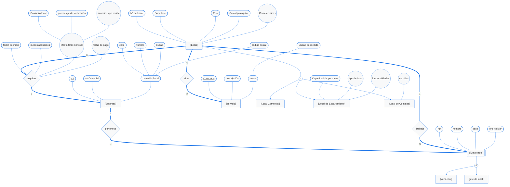

# Documentación Conceptual y Lógica: Centro Comercial

Este documento presenta el diseño de base de datos para la gestión integral de un centro comercial. Se incluye el **Modelo Conceptual** en Notación de Chen (que mapea con exactitud el archivo de DIA) y el **Modelo Lógico Relacional** en Notación de Patas de Gallo, optimizado para su posterior implementación en SQL.

---

## 1. Modelo Conceptual (Notación de Chen)

El siguiente diagrama de flujo interactivo de Mermaid representa con absoluta fidelidad la estructura del archivo `Tarea_DIA_Valenzuela_Nuche.dia`. 

*   **Rectángulos simples `[Entidad]`**: Entidades fuertes.
*   **Rectángulos dobles `[[Entidad]]`**: Entidades débiles.
*   **Óvalos simples `([Atributo])`**: Atributos simples.
*   **Óvalos con texto subrayado `(["<u>Atributo</u>"])`**: Atributos clave (primarios o parciales).
*   **Óvalos dobles `((Atributo))`**: Atributos multivaluados (pueden tener múltiples valores).
*   **Rombos `{"Relación"}`**: Relaciones entre entidades.
*   **Círculos con "d" `((d))`**: Especialización/generalización disyunta (herencia).



---

## 2. Diccionario de Datos Interactivo

Haz clic en cada sección desplegable para conocer en detalle los metadatos conceptuales extraídos de DIA:

<details>
<summary><b>🏢 Entidades Fuertes y Débiles</b></summary>

### Empresa
*   **Definición**: Entidad jurídica que arrienda uno o más locales dentro del centro comercial.
*   **Atributos**:
    *   `rut` (Clave Primaria): Identificador único tributario nacional de la empresa.
    *   `razón social`: Nombre legal registrado de la empresa.
    *   `domicilio fiscal` (Compuesto): Dirección oficial de contacto tributario. Se ramifica en:
        *   `calle`: Vía pública del domicilio.
        *   `número`: Numeración física del domicilio.
        *   `ciudad`: Comuna o urbe geográfica.
        *   `codigo postal`: Código postal de envío postal.

### Local
*   **Definición**: Espacio físico delimitado del centro comercial disponible para arriendo.
*   **Atributos**:
    *   `N° de Local` (Clave Primaria): Número identificador único del inmueble.
    *   `Superficie`: Área física total expresada en metros cuadrados.
    *   `Piso`: Nivel de altura o planta física donde se encuentra emplazado.
    *   `Costo fijo alquiler`: Monto de canon de arrendamiento base pactado.
    *   `Características` (Multivaluado): Lista de cualidades del local (p. ej., conexión trifásica, salida de humos).

### Empleado (Entidad Débil)
*   **Definición**: Personal contratado por una Empresa que presta servicios en un Local específico. En el archivo DIA está marcada explícitamente como una entidad débil debido a su dependencia existencial de la Empresa.
*   **Atributos**:
    *   `run` (Clave Parcial): Cédula de identidad nacional chilena.
    *   `nombre`: Nombre completo del trabajador.
    *   `sexo`: Género registral.
    *   `nro_celular`: Teléfono de contacto móvil.

### servicio
*   **Definición**: Prestaciones de suministros básicos o adicionales (p. ej., electricidad, agua, seguridad privada) provistos a los locales.
*   **Atributos**:
    *   `n° servicio` (Clave Primaria): Número correlativo único del tipo de servicio.
    *   `descripción`: Resumen cualitativo de la prestación.
    *   `costo` (Compuesto): Tarifa asignada que se compone de:
        *   `unidad de medida`: Factor volumétrico de cobro (p. ej., kWh, m³, hora).
</details>

<details>
<summary><b>🔄 Especializaciones y Herencia (Jerarquías)</b></summary>

Ambas especializaciones en el diagrama DIA están definidas bajo la restricción de **Disyunción Total (d)**, lo que implica que una instancia de la superclase pertenece a lo sumo a una de las subclases y obligatoriamente debe estar en alguna de ellas.

### Especialización de Local
*   **Clase Padre**: `Local`
*   **Clases Hijas**:
    *   `Local Comercial`: Local destinado a la venta minorista de vestuario, tecnología, calzado u otros bienes. No posee atributos adicionales en el modelo conceptual.
    *   `Local de Esparcimiento`: Local destinado a actividades recreativas o de ocio (cines, juegos mecánicos). Posee los atributos:
        *   `Capacidad de personas`: Aforo máximo permitido por normas de seguridad.
        *   `tipo de local` (Multivaluado): Categorías de esparcimiento aplicables.
        *   `funcionalidades` (Multivaluado): Lista de atracciones o facilidades provistas.
    *   `Local de Comidas`: Establecimiento gastronómico (restaurantes, patios de comida). Posee el atributo:
        *   `comidas` (Multivaluado): Lista de especialidades de alimentos ofrecidas (p. ej., comida rápida, sushi, pastas).

### Especialización de Empleado
*   **Clase Padre**: `Empleado`
*   **Clases Hijas**:
    *   `vendedor`: Empleado con funciones de atención directa al público y ventas.
    *   `jefe de local`: Encargado de la supervisión administrativa e inventario del local.
</details>

<details>
<summary><b>🤝 Relaciones Conceptuales</b></summary>

### alquilan
*   **Participantes**: `Empresa` (1) y `Local` (N).
*   **Semántica**: Representa el contrato de arrendamiento formal del local comercial por parte de la empresa.
*   **Atributos de la Relación**:
    *   `fecha de inicio`: Fecha de entrada en vigencia del arriendo. Actúa como discriminador temporal del contrato.
    *   `meses acordados`: Duración contractual estipulada.
    *   `fecha de pago` (Multivaluado): Fechas efectivas de vencimiento mensual del pago de renta.
    *   `Monto total mensual` (Compuesto y Multivaluado): Monto global calculado cada mes, compuesto de:
        *   `Costo fijo local`: Cargo base del arriendo.
        *   `porcentaje de facturación`: Comisión variable sobre las ventas mensuales del local.
        *   `servicios que recibe` (Multivaluado): Los servicios particulares facturados en el periodo.

### pertenece
*   **Participantes**: `Empleado` (N) y `Empresa` (1).
*   **Semántica**: Relación laboral mediante la cual un empleado pertenece formalmente a la planilla contractual de una única empresa.

### Trabaja
*   **Participantes**: `Empleado` (N) y `Local` (1).
*   **Semántica**: Asignación física operativa que indica en cuál local del centro comercial presta servicios reales el empleado.

### sirve
*   **Participantes**: `Local` (N) y `servicio` (M).
*   **Semántica**: Relación de N:M mediante la cual múltiples locales están suscritos a recibir múltiples servicios generales de administración o suministros básicos.
</details>

---

## 3. Modelo Lógico Relacional (Notación de Patas de Gallo)

El siguiente diagrama lógico relacional, diseñado bajo la Notación de Patas de Gallo (Crow's Foot) en Mermaid `erDiagram`, representa la arquitectura física de base de datos una vez resueltas todas las normalizaciones (aplanamientos, herencia TPT y atributos multivaluados):

```mermaid
%%{init: {'theme': 'base', 'themeVariables': { 'primaryColor': '#E2ECF9', 'edgeColor': '#1A73E8', 'nodeBorder': '#1A73E8', 'textColor': '#202124' }}}%%
erDiagram
    EMPRESA {
        VARCHAR rut PK "RUT de la empresa (Identificador único)"
        VARCHAR razon_social "Nombre de razón social"
        VARCHAR domicilio_fiscal_calle "Calle de ubicación fiscal"
        VARCHAR domicilio_fiscal_numero "Número exterior de ubicación fiscal"
        VARCHAR domicilio_fiscal_ciudad "Ciudad o Comuna fiscal"
        VARCHAR domicilio_fiscal_codigo_postal "Código postal fiscal"
    }

    LOCAL {
        VARCHAR n_local PK "Número identificador físico del local"
        DECIMAL superficie "Superficie en metros cuadrados"
        INTEGER piso "Número de planta física"
        DECIMAL costo_fijo_alquiler "Canon base de arriendo"
    }

    CARACTERISTICAS_LOCAL {
        VARCHAR local_n_local PK, FK "Ref: LOCAL"
        VARCHAR caracteristica PK "Cualidad física (Multivaluado)"
    }

    LOCAL_COMERCIAL {
        VARCHAR local_n_local PK, FK "Ref: LOCAL"
    }

    LOCAL_ESPARCIMIENTO {
        VARCHAR local_n_local PK, FK "Ref: LOCAL"
        INTEGER capacidad_personas "Aforo máximo"
    }

    TIPOS_ESPARCIMIENTO {
        VARCHAR local_n_local PK, FK "Ref: LOCAL_ESPARCIMIENTO"
        VARCHAR tipo_local PK "Categoría de ocio (Multivaluado)"
    }

    FUNCIONALIDADES_ESPARCIMIENTO {
        VARCHAR local_n_local PK, FK "Ref: LOCAL_ESPARCIMIENTO"
        VARCHAR funcionalidad PK "Facilidad o atracción (Multivaluado)"
    }

    LOCAL_COMIDAS {
        VARCHAR local_n_local PK, FK "Ref: LOCAL"
    }

    COMIDAS_LOCAL {
        VARCHAR local_n_local PK, FK "Ref: LOCAL_COMIDAS"
        VARCHAR comida PK "Especialidad alimentaria (Multivaluado)"
    }

    EMPLEADO {
        VARCHAR run PK " RUN del empleado (Clave primaria física)"
        VARCHAR nombre "Nombre completo"
        VARCHAR sexo "Género registral"
        VARCHAR nro_celular "Teléfono móvil de contacto"
        VARCHAR empresa_rut_fk FK "Ref: EMPRESA (pertenece)"
        VARCHAR local_n_local_fk FK "Ref: LOCAL (Trabaja)"
    }

    VENDEDOR {
        VARCHAR empleado_run_fk PK, FK "Ref: EMPLEADO"
    }

    JEFE_DE_LOCAL {
        VARCHAR empleado_run_fk PK, FK "Ref: EMPLEADO"
    }

    SERVICIO {
        INTEGER n_servicio PK "Identificador único correlativo"
        VARCHAR descripcion "Detalle cualitativo del servicio"
        DECIMAL costo_valor "Tarifa de costo unitario base"
        VARCHAR costo_unidad_medida "Unidad volumétrica de cobro"
    }

    LOCAL_SERVICIO {
        VARCHAR local_n_local_fk PK, FK "Ref: LOCAL (sirve)"
        INTEGER servicio_n_servicio_fk PK, FK "Ref: SERVICIO (sirve)"
    }

    ALQUILER {
        VARCHAR empresa_rut_fk PK, FK "Ref: EMPRESA"
        VARCHAR local_n_local_fk PK, FK "Ref: LOCAL"
        DATE fecha_inicio PK "Fecha de entrada en vigencia"
        INTEGER meses_acordados "Meses contractuales de vigencia"
        DECIMAL monto_total_mensual_costo_fijo "Monto fijo mensual pactado"
        DECIMAL monto_total_mensual_porcentaje_facturacion "Tasa porcentual variable de facturación"
    }

    FECHAS_PAGO_ALQUILER {
        VARCHAR empresa_rut_fk PK, FK "Ref: ALQUILER"
        VARCHAR local_n_local_fk PK, FK "Ref: ALQUILER"
        DATE fecha_inicio_fk PK, FK "Ref: ALQUILER"
        DATE fecha_pago PK "Fecha límite de cobro mensual (Multivaluado)"
    }

    SERVICIOS_ALQUILER {
        VARCHAR empresa_rut_fk PK, FK "Ref: ALQUILER"
        VARCHAR local_n_local_fk PK, FK "Ref: ALQUILER"
        DATE fecha_inicio_fk PK, FK "Ref: ALQUILER"
        VARCHAR servicio_recibido PK "Suministro facturado (Multivaluado)"
    }

    %% --- Relaciones relacionales ---
    EMPRESA ||--o{ EMPLEADO : "pertenece (1:N)"
    LOCAL ||--o{ EMPLEADO : "Trabaja (1:N)"
    LOCAL ||--|{ CARACTERISTICAS_LOCAL : "tiene_caracteristicas (1:N)"
    
    %% Herencia Local (TPT)
    LOCAL ||--|| LOCAL_COMERCIAL : "es_un (1:1)"
    LOCAL ||--|| LOCAL_ESPARCIMIENTO : "es_un (1:1)"
    LOCAL ||--|| LOCAL_COMIDAS : "es_un (1:1)"

    %% Multivaluados de Subclases Local
    LOCAL_ESPARCIMIENTO ||--|{ TIPOS_ESPARCIMIENTO : "tiene_tipos (1:N)"
    LOCAL_ESPARCIMIENTO ||--|{ FUNCIONALIDADES_ESPARCIMIENTO : "tiene_funcionalidades (1:N)"
    LOCAL_COMIDAS ||--|{ COMIDAS_LOCAL : "ofrece_comidas (1:N)"

    %% Herencia Empleado (TPT)
    EMPLEADO ||--|| VENDEDOR : "es_un (1:1)"
    EMPLEADO ||--|| JEFE_DE_LOCAL : "es_un (1:1)"

    %% Relación Sirve (N:M a intermedia)
    LOCAL ||--|{ LOCAL_SERVICE : "recibe"
    SERVICIO ||--|{ LOCAL_SERVICE : "es_provisto"

    %% Relación Alquiler con Atributos
    EMPRESA ||--|{ ALQUILER : "contrata (1:N)"
    LOCAL ||--|{ ALQUILER : "arrienda (1:N)"
    ALQUILER ||--|{ FECHAS_PAGO_ALQUILER : "vence_en (1:N)"
    ALQUILER ||--|{ SERVICIOS_ALQUILER : "factura_servicios (1:N)"
```



---

## 4. Estructura Física y Esquemas de Tablas SQL

A continuación se detallan las especificaciones técnicas completas y los esquemas SQL normalizados (cumpliendo estricta 3NF a nivel relacional) para la base de datos física:

<details>
<summary><b>📐 Tablas Fuertes del Centro Comercial</b></summary>

### 1. Tabla `EMPRESA`
Representa a las personas jurídicas que arriendan locales. Los atributos compuestos de domicilio fiscal se han aplanado.

```sql
CREATE TABLE EMPRESA (
    rut VARCHAR(20) PRIMARY KEY,
    razon_social VARCHAR(150) NOT NULL,
    domicilio_fiscal_calle VARCHAR(100) NOT NULL,
    domicilio_fiscal_numero VARCHAR(20) NOT NULL,
    domicilio_fiscal_ciudad VARCHAR(50) NOT NULL,
    domicilio_fiscal_codigo_postal VARCHAR(20)
);
```

### 2. Tabla `LOCAL`
Superclase que almacena los inmuebles del centro comercial.

```sql
CREATE TABLE LOCAL (
    n_local VARCHAR(30) PRIMARY KEY,
    superficie DECIMAL(10,2) NOT NULL CHECK (superficie > 0),
    piso INTEGER NOT NULL CHECK (piso >= 1),
    costo_fijo_alquiler DECIMAL(12,2) NOT NULL CHECK (costo_fijo_alquiler >= 0)
);
```

### 3. Tabla `SERVICIO`
Suministros y prestaciones disponibles generales.

```sql
CREATE TABLE SERVICIO (
    n_servicio INTEGER PRIMARY KEY AUTOINCREMENT,
    descripcion VARCHAR(200) NOT NULL,
    costo_valor DECIMAL(10,2) NOT NULL CHECK (costo_valor >= 0),
    costo_unidad_medida VARCHAR(30) NOT NULL
);
```
</details>

<details>
<summary><b>🛡️ Tablas para Atributos Multivaluados (1NF)</b></summary>

### 4. Tabla `CARACTERISTICAS_LOCAL`
Almacena el atributo multivaluado `Características` de `Local`.
*   **PK compuesta**: `local_n_local` + `caracteristica`.

```sql
CREATE TABLE CARACTERISTICAS_LOCAL (
    local_n_local VARCHAR(30) NOT NULL,
    caracteristica VARCHAR(100) NOT NULL,
    PRIMARY KEY (local_n_local, caracteristica),
    FOREIGN KEY (local_n_local) REFERENCES LOCAL(n_local) ON DELETE CASCADE
);
```
</details>

<details>
<summary><b>🌳 Tablas de Especializaciones e Hijas (TPT)</b></summary>

Cada subclase posee su propia tabla, con claves primarias que son al mismo tiempo claves foráneas operativas hacia sus respectivas superclases.

### 5. Tabla `LOCAL_COMERCIAL`
Subclase de Local sin atributos especiales en DIA.
```sql
CREATE TABLE LOCAL_COMERCIAL (
    local_n_local VARCHAR(30) PRIMARY KEY,
    FOREIGN KEY (local_n_local) REFERENCES LOCAL(n_local) ON DELETE CASCADE
);
```

### 6. Tabla `LOCAL_ESPARCIMIENTO`
Subclase de Local dedicada al entretenimiento con aforo.
```sql
CREATE TABLE LOCAL_ESPARCIMIENTO (
    local_n_local VARCHAR(30) PRIMARY KEY,
    capacidad_personas INTEGER NOT NULL CHECK (capacidad_personas > 0),
    FOREIGN KEY (local_n_local) REFERENCES LOCAL(n_local) ON DELETE CASCADE
);
```

### 7. Tabla `TIPOS_ESPARCIMIENTO`
Almacena el multivaluado `tipo de local` para la subclase Esparcimiento.
```sql
CREATE TABLE TIPOS_ESPARCIMIENTO (
    local_n_local VARCHAR(30) NOT NULL,
    tipo_local VARCHAR(50) NOT NULL,
    PRIMARY KEY (local_n_local, tipo_local),
    FOREIGN KEY (local_n_local) REFERENCES LOCAL_ESPARCIMIENTO(local_n_local) ON DELETE CASCADE
);
```

### 8. Tabla `FUNCIONALIDADES_ESPARCIMIENTO`
Almacena el multivaluado `funcionalidades` para la subclase Esparcimiento.
```sql
CREATE TABLE FUNCIONALIDADES_ESPARCIMIENTO (
    local_n_local VARCHAR(30) NOT NULL,
    funcionalidad VARCHAR(100) NOT NULL,
    PRIMARY KEY (local_n_local, funcionalidad),
    FOREIGN KEY (local_n_local) REFERENCES LOCAL_ESPARCIMIENTO(local_n_local) ON DELETE CASCADE
);
```

### 9. Tabla `LOCAL_COMIDAS`
Subclase de Local destinada a la gastronomía.
```sql
CREATE TABLE LOCAL_COMIDAS (
    local_n_local VARCHAR(30) PRIMARY KEY,
    FOREIGN KEY (local_n_local) REFERENCES LOCAL(n_local) ON DELETE CASCADE
);
```

### 10. Tabla `COMIDAS_LOCAL`
Almacena el multivaluado `comidas` para la subclase de Comidas.
```sql
CREATE TABLE COMIDAS_LOCAL (
    local_n_local VARCHAR(30) NOT NULL,
    comida VARCHAR(100) NOT NULL,
    PRIMARY KEY (local_n_local, comida),
    FOREIGN KEY (local_n_local) REFERENCES LOCAL_COMIDAS(local_n_local) ON DELETE CASCADE
);
```
</details>

<details>
<summary><b>👤 Personal y Estructura Organizativa</b></summary>

### 11. Tabla `EMPLEADO`
Entidad débil conceptualmente, que a nivel físico se implementa con claves foráneas cruzadas para modelar las relaciones `pertenece` y `Trabaja`.

```sql
CREATE TABLE EMPLEADO (
    run VARCHAR(20) PRIMARY KEY,
    nombre VARCHAR(150) NOT NULL,
    sexo VARCHAR(20) NOT NULL,
    nro_celular VARCHAR(30),
    empresa_rut_fk VARCHAR(20) NOT NULL,
    local_n_local_fk VARCHAR(30) NOT NULL,
    FOREIGN KEY (empresa_rut_fk) REFERENCES EMPRESA(rut) ON DELETE RESTRICT,
    FOREIGN KEY (local_n_local_fk) REFERENCES LOCAL(n_local) ON DELETE RESTRICT
);
```

### 12. Tabla `VENDEDOR`
Especialización de Empleado.
```sql
CREATE TABLE VENDEDOR (
    empleado_run_fk VARCHAR(20) PRIMARY KEY,
    FOREIGN KEY (empleado_run_fk) REFERENCES EMPLEADO(run) ON DELETE CASCADE
);
```

### 13. Tabla `JEFE_DE_LOCAL`
Especialización de Empleado.
```sql
CREATE TABLE JEFE_DE_LOCAL (
    empleado_run_fk VARCHAR(20) PRIMARY KEY,
    FOREIGN KEY (empleado_run_fk) REFERENCES EMPLEADO(run) ON DELETE CASCADE
);
```
</details>

<details>
<summary><b>💼 Tablas Transaccionales de Contratos y Servicios</b></summary>

### 14. Tabla Intermedia `LOCAL_SERVICIO` (Relación N:M sirve)
Mapea la asociación N:M entre locales y servicios provistos.
```sql
CREATE TABLE LOCAL_SERVICIO (
    local_n_local_fk VARCHAR(30) NOT NULL,
    servicio_n_servicio_fk INTEGER NOT NULL,
    PRIMARY KEY (local_n_local_fk, servicio_n_servicio_fk),
    FOREIGN KEY (local_n_local_fk) REFERENCES LOCAL(n_local) ON DELETE CASCADE,
    FOREIGN KEY (servicio_n_servicio_fk) REFERENCES SERVICIO(n_servicio) ON DELETE CASCADE
);
```

### 15. Tabla Contrato `ALQUILER` (Relación alquilan con atributos)
Mapea la relación transaccional con atributos descriptivos y su clave temporal.
```sql
CREATE TABLE ALQUILER (
    empresa_rut_fk VARCHAR(20) NOT NULL,
    local_n_local_fk VARCHAR(30) NOT NULL,
    fecha_inicio DATE NOT NULL,
    meses_acordados INTEGER NOT NULL CHECK (meses_acordados > 0),
    monto_total_mensual_costo_fijo DECIMAL(12,2) NOT NULL CHECK (monto_total_mensual_costo_fijo >= 0),
    monto_total_mensual_porcentaje_facturacion DECIMAL(5,2) NOT NULL CHECK (monto_total_mensual_porcentaje_facturacion >= 0),
    PRIMARY KEY (empresa_rut_fk, local_n_local_fk, fecha_inicio),
    FOREIGN KEY (empresa_rut_fk) REFERENCES EMPRESA(rut) ON DELETE RESTRICT,
    FOREIGN KEY (local_n_local_fk) REFERENCES LOCAL(n_local) ON DELETE RESTRICT
);
```

### 16. Tabla Satélite `FECHAS_PAGO_ALQUILER` (Multivaluado de Alquiler)
Resuelve el atributo multivaluado `fecha de pago` asociado a la relación.
```sql
CREATE TABLE FECHAS_PAGO_ALQUILER (
    empresa_rut_fk VARCHAR(20) NOT NULL,
    local_n_local_fk VARCHAR(30) NOT NULL,
    fecha_inicio_fk DATE NOT NULL,
    fecha_pago DATE NOT NULL,
    PRIMARY KEY (empresa_rut_fk, local_n_local_fk, fecha_inicio_fk, fecha_pago),
    FOREIGN KEY (empresa_rut_fk, local_n_local_fk, fecha_inicio_fk) 
        REFERENCES ALQUILER(empresa_rut_fk, local_n_local_fk, fecha_inicio) ON DELETE CASCADE
);
```

### 17. Tabla Satélite `SERVICIOS_ALQUILER` (Multivaluado del compuesto de Alquiler)
Resuelve el atributo multivaluado `servicios que recibe` asociado al monto total mensual.
```sql
CREATE TABLE SERVICIOS_ALQUILER (
    empresa_rut_fk VARCHAR(20) NOT NULL,
    local_n_local_fk VARCHAR(30) NOT NULL,
    fecha_inicio_fk DATE NOT NULL,
    servicio_recibido VARCHAR(100) NOT NULL,
    PRIMARY KEY (empresa_rut_fk, local_n_local_fk, fecha_inicio_fk, servicio_recibido),
    FOREIGN KEY (empresa_rut_fk, local_n_local_fk, fecha_inicio_fk) 
        REFERENCES ALQUILER(empresa_rut_fk, local_n_local_fk, fecha_inicio) ON DELETE CASCADE
);
```
</details>
