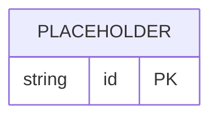

# Documentación Conceptual y Lógica: Centro Comercial

Este documento presenta el diseño de base de datos para la gestión integral de un centro comercial. Se incluye el **Modelo Conceptual** en Notación de Chen (que mapea con exactitud el archivo de DIA) y el **Modelo Lógico Relacional** en Notación de Patas de Gallo, optimizado para su posterior implementación en SQL.

---

## 1. Modelo Conceptual (Notación de Chen)

El siguiente diagrama de flujo interactivo de Mermaid representa con absoluta fidelidad la estructura del archivo `Tarea_DIA_Valenzuela_Nuche.dia`. 

*   **Rectángulos simples `[Entidad]`**: Entidades fuertes.
*   **Rectángulos dobles `[[Entidad]]`**: Entidades débiles.
*   **Óvalos simples `([Atributo])`**: Atributos simples.
*   **Óvalos con texto subrayado `(["<u>Atributo</u>"])`**: Atributos clave (primarios o parciales).
*   **Óvalos dobles `((Atributo))`**: Atributos multivaluados (pueden tener múltiples valores).
*   **Rombos `{"Relación"}`**: Relaciones entre entidades.
*   **Círculos con "d" `((d))`**: Especialización/generalización disyunta (herencia).

---

## 2. Diccionario de Datos Interactivo

Haz clic en cada sección desplegable para conocer en detalle los metadatos conceptuales extraídos de DIA:

<b>🏢 Entidades Fuertes y Débiles</b>

### Empresa
*   **Definición**: Entidad jurídica que arrienda uno o más locales dentro del centro comercial.
*   **Atributos**:
    *   `rut` (Clave Primaria): Identificador único tributario nacional de la empresa.
    *   `razón social`: Nombre legal registrado de la empresa.
    *   `domicilio fiscal` (Compuesto): Dirección oficial de contacto tributario. Se ramifica en:
        *   `calle`: Vía pública del domicilio.
        *   `número`: Numeración física del domicilio.
        *   `ciudad`: Comuna o urbe geográfica.
        *   `codigo postal`: Código postal de envío postal.

### Local
*   **Definición**: Espacio físico delimitado del centro comercial disponible para arriendo.
*   **Atributos**:
    *   `N° de Local` (Clave Primaria): Número identificador único del inmueble.
    *   `Superficie`: Área física total expresada en metros cuadrados.
    *   `Piso`: Nivel de altura o planta física donde se encuentra emplazado.
    *   `Costo fijo alquiler`: Monto de canon de arrendamiento base pactado.
    *   `Características` (Multivaluado): Lista de cualidades del local (p. ej., conexión trifásica, salida de humos).

### Empleado (Entidad Débil)
*   **Definición**: Personal contratado por una Empresa que presta servicios en un Local específico. En el archivo DIA está marcada explícitamente como una entidad débil debido a su dependencia existencial de la Empresa.
*   **Atributos**:
    *   `run` (Clave Parcial): Cédula de identidad nacional chilena.
    *   `nombre`: Nombre completo del trabajador.
    *   `sexo`: Género registral.
    *   `nro_celular`: Teléfono de contacto móvil.

### servicio
*   **Definición**: Prestaciones de suministros básicos o adicionales (p. ej., electricidad, agua, seguridad privada) provistos a los locales.
*   **Atributos**:
    *   `n° servicio` (Clave Primaria): Número correlativo único del tipo de servicio.
    *   `descripción`: Resumen cualitativo de la prestación.
    *   `costo` (Compuesto): Tarifa asignada que se compone de:
        *   `unidad de medida`: Factor volumétrico de cobro (p. ej., kWh, m³, hora).

<b>🔄 Especializaciones y Herencia (Jerarquías)</b>

Ambas especializaciones en el diagrama DIA están definidas bajo la restricción de **Disyunción Total (d)**, lo que implica que una instancia de la superclase pertenece a lo sumo a una de las subclases y obligatoriamente debe estar en alguna de ellas.

### Especialización de Local
*   **Clase Padre**: `Local`
*   **Clases Hijas**:
    *   `Local Comercial`: Local destinado a la venta minorista de vestuario, tecnología, calzado u otros bienes. No posee atributos adicionales en el modelo conceptual.
    *   `Local de Esparcimiento`: Local destinado a actividades recreativas o de ocio (cines, juegos mecánicos). Posee los atributos:
        *   `Capacidad de personas`: Aforo máximo permitido por normas de seguridad.
        *   `tipo de local` (Multivaluado): Categorías de esparcimiento aplicables.
        *   `funcionalidades` (Multivaluado): Lista de atracciones o facilidades provistas.
    *   `Local de Comidas`: Establecimiento gastronómico (restaurantes, patios de comida). Posee el atributo:
        *   `comidas` (Multivaluado): Lista de especialidades de alimentos ofrecidas (p. ej., comida rápida, sushi, pastas).

### Especialización de Empleado
*   **Clase Padre**: `Empleado`
*   **Clases Hijas**:
    *   `vendedor`: Empleado con funciones de atención directa al público y ventas.
    *   `jefe de local`: Encargado de la supervisión administrativa e inventario del local.

<b>🤝 Relaciones Conceptuales</b>

### alquilan
*   **Participantes**: `Empresa` (1) y `Local` (N).
*   **Semántica**: Representa el contrato de arrendamiento formal del local comercial por parte de la empresa.
*   **Atributos de la Relación**:
    *   `fecha de inicio`: Fecha de entrada en vigencia del arriendo. Actúa como discriminador temporal del contrato.
    *   `meses acordados`: Duración contractual estipulada.
    *   `fecha de pago` (Multivaluado): Fechas efectivas de vencimiento mensual del pago de renta.
    *   `Monto total mensual` (Compuesto y Multivaluado): Monto global calculado cada mes, compuesto de:
        *   `Costo fijo local`: Cargo base del arriendo.
        *   `porcentaje de facturación`: Comisión variable sobre las ventas mensuales del local.
        *   `servicios que recibe` (Multivaluado): Los servicios particulares facturados en el periodo.

### pertenece
*   **Participantes**: `Empleado` (N) y `Empresa` (1).
*   **Semántica**: Relación laboral mediante la cual un empleado pertenece formalmente a la planilla contractual de una única empresa.

### Trabaja
*   **Participantes**: `Empleado` (N) y `Local` (1).
*   **Semántica**: Asignación física operativa que indica en cuál local del centro comercial presta servicios reales el empleado.

### sirve
*   **Participantes**: `Local` (N) y `servicio` (M).
*   **Semántica**: Relación de N:M mediante la cual múltiples locales están suscritos a recibir múltiples servicios generales de administración o suministros básicos.

---

## 3. Modelo Lógico Relacional (Notación de Patas de Gallo)

*(Esta sección se detallará por completo en la siguiente tarea del plan con el diagrama lógico relacional Mermaid erDiagram optimizado y libre de errores sintácticos).*

---

## 4. Estructura Física y Esquemas de Tablas SQL

*(Esta sección se detallará por completo en la siguiente tarea del plan con la estructura de base de datos normalizada lista para SQL).*
